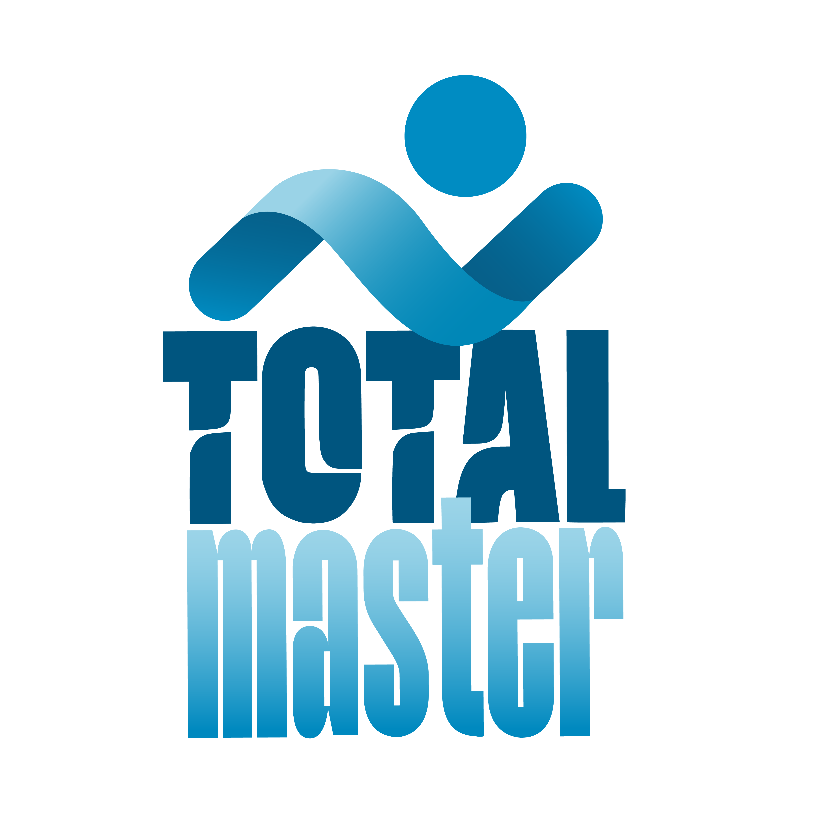

# Hey, I'm Andrés Vaninetti 👋  
### QA Architect | Testing Strategy & Quality Engineering | Full-Stack Product Builder

I architect comprehensive quality systems and strategies that prevent defects at every stage of software delivery. As a **QA Architect**, I design testing frameworks, quality gates, and reliability standards that enable teams to ship fast **and** safe — balancing velocity with confidence.

Beyond my core QA architecture expertise, I'm the **Founder, Software Architect & Full-Stack Developer behind TotalMaster Swim** — a production platform I designed, built, and launched entirely solo, now scaled to a **4-member team**. This represents my complete ownership: system architecture, full-stack development, quality strategy, product vision, and team leadership.

  
  

---

## 🏛️ QA Architecture & Quality Engineering

### Strategic Quality Design
- **Quality System Architecture** — Designing end-to-end testing frameworks, automation pipelines, and quality gates  
- **Test Strategy & Planning** — Risk-based testing approaches, coverage architecture, and release readiness frameworks  
- **Automation Framework Design** — Building scalable, maintainable test infrastructure for teams  
- **Quality Metrics & Governance** — Defect analytics, quality scorecards, and data-driven decision making  
- **CI/CD Integration** — Implementing automated quality gates and continuous testing practices

### Core Architectural Focus
- 🏗️ **Quality by Design** — Preventing defects through strategic architecture and early testing  
- ⚡ **Velocity + Reliability** — Designing systems that scale testing without slowing delivery  
- 📐 **Scalable Testing Systems** — Frameworks that grow with team and product complexity  
- 📊 **Quality Intelligence** — Metrics-driven insights for risk prioritization and process optimization  
- 🤝 **Cross-Functional Quality Culture** — Embedding quality thinking into Dev, Product, and Ops

### Hands-On Expertise
- **Manual Testing** — Exploratory, regression, sanity, and user acceptance testing  
- **Test Automation** — End-to-end, API, and integration test frameworks  
- **Performance & Reliability** — Load testing, monitoring, and incident prevention

---

## 🚀 Founder, Software Architect & Full-Stack Developer: TotalMaster Swim

  

**TotalMaster Swim** is a production platform supporting swim training and coaching workflows — **architected, developed, and launched entirely by me**, now scaled to a **4-member team**.

### The Journey
- 🏗️ **System Architecture** — Designed the entire platform architecture from first principles  
- 💻 **Full-Stack Development** — Built complete product solo (frontend, backend, infrastructure, database)  
- 🚀 **Production Launch** — Took product from concept to production with zero external technical help  
- 👥 **Team Building** — Hired and mentored 3 team members; now leading as Founder  
- 📈 **220+ Organic Users** �� Real coaches and swimmers trusting the platform  
- ✅ **Continuous Scale** — Live product with active feedback loops and evolution

### My Role as Founder & Architect
- **System Architecture** — Designed scalable, reliable infrastructure and application architecture  
- **Full-Stack Engineering** — End-to-end development across frontend, backend, and DevOps  
- **Quality & Reliability** — Built quality into architecture; implemented monitoring, testing, and incident prevention  
- **Product Vision & Strategy** — Market discovery, user research, roadmap prioritization  
- **Team Leadership** — Recruiting, hiring, onboarding, and mentoring the engineering team  
- **Business & Operations** — User acquisition, metrics, sustainability, and strategic direction

### Why This Demonstrates My Capability
TotalMaster is proof of **complete technical ownership** — not just executing tasks, but **architecting systems**, **building full-stack products**, and **leading teams to scale**. It shows I can move from **quality strategy to hands-on development to architectural decisions to team leadership** across a real, production system.

  

---

## 🎯 Quick Snapshot

- 🏛️ **QA Architect** — Design quality systems, testing frameworks, and reliability strategies  
- 💻 **Full-Stack Software Architect** — Design and build production systems end-to-end  
- 👨‍💼 **Founder & Technical Leader** — Built TotalMaster from architecture to team leadership  
- 🔄 **Complete Ownership** — From system design through development through quality to team scaling  
- 📈 **Data-Driven** — Metrics-based decisions on quality, architecture, product, and business  
- 🌍 **Remote & Distributed** — Leading teams and collaborating across geographies  

---

## 🧰 Tech Stack & Architectural Expertise

**Quality Architecture & Testing**  
`Testing Framework Design` `Jest` `Cypress` `API Testing` `CI/CD Pipeline Architecture` `Quality Metrics & Analytics`

**System Architecture**  
`Microservices Concepts` `API Design` `Database Architecture` `Scalability Patterns` `Performance Optimization`

**Full-Stack Development**  
`TypeScript` `JavaScript` `React` `Next.js` `Node.js` `Express` `PostgreSQL` `Firebase`

**Infrastructure & DevOps**  
`Docker` `Git` `GitHub` `CI/CD Implementation` `Monitoring & Observability` `Cloud Infrastructure`

**Workflow & Leadership**  
`Agile Architecture` `Test-Driven Development (TDD)` `System Design` `Team Leadership` `Product Strategy`

---

## 📂 What You'll Find in My Repositories

- **Architectural Decisions** — System design patterns, scaling strategies, and reliability practices  
- **Quality Infrastructure** — Testing frameworks, automation pipelines, and monitoring  
- **Production-Grade Code** — Full-stack implementation reflecting architectural principles  
- **TotalMaster Codebase** — Complete product demonstrating system architecture + full-stack execution  
- **Test Strategy & Documentation** — Architectural approach to quality at scale

---

## 💼 I'm Looking For

- **QA Architect / Quality Engineering Lead** roles  
- **Technical Architect** positions (with quality focus)  
- **Founder-friendly** technical leadership opportunities  
- **Software Architect** roles with product ownership  
- Teams where **quality architecture is strategic**, technical leadership matters, and founder-operators are valued

---

## 🤝 Let's Connect

- 💼 **LinkedIn:** [andres-vaninetti](https://www.linkedin.com/in/andres-vaninetti/)  
- 🏢 **TotalMaster Project:** [TotalMaster Swim](https://www.linkedin.com/company/totalmaster-swim/)  
- 📫 **Email:** andrelovaninetti@gmail.com

If you're building a team that needs someone who architects quality systems, designs production software, **and** scales teams to deliver reliable products fast, let's talk.

---

## 📊 GitHub Activity

  
  

  

